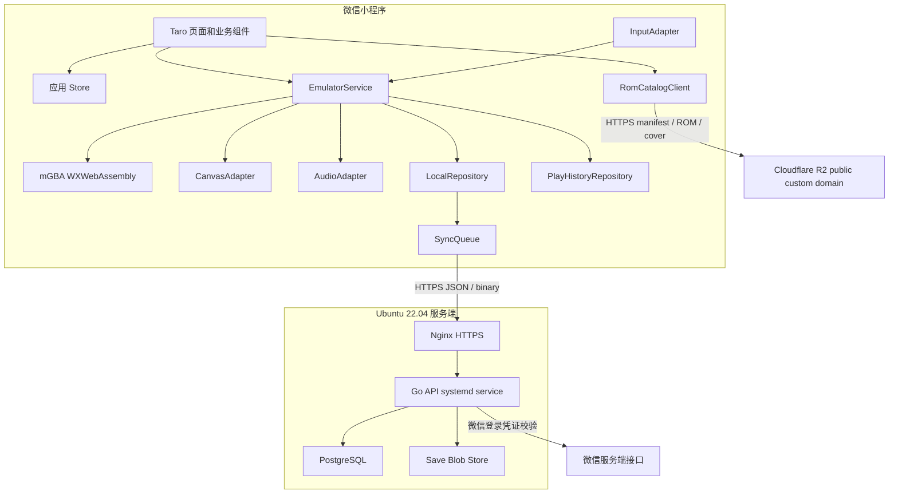
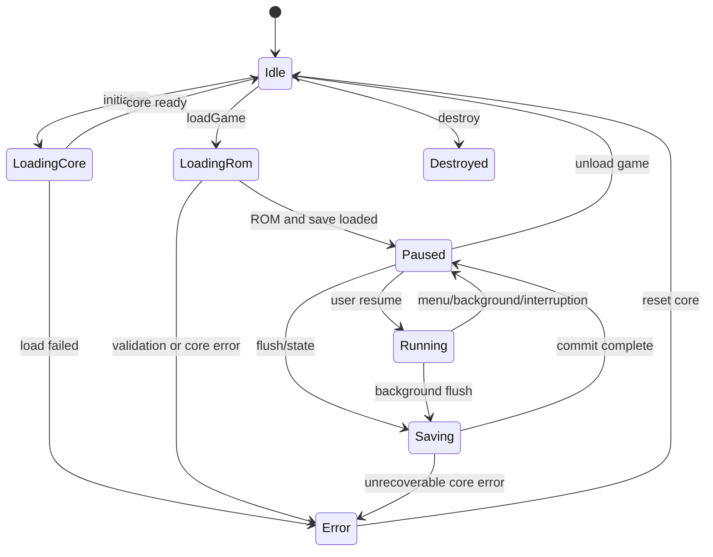

# MiniGBA 总体技术设计

版本：1.0  
状态：规划基线  
构建与服务端环境：Ubuntu 22.04 LTS 裸机

## 1. 设计目标

本设计将高频、确定性的模拟器运行时与低频、声明式的 Taro 业务界面分离，确保：

- 模拟器核心可以独立构建、测试和升级。
- 每帧画面、音频样本和按键状态不进入 React 状态树。
- ROM 和存档在本地优先工作，网络不可用时仍可游玩。
- 云同步具有明确版本和冲突语义，不以“最后写入覆盖一切”为策略。
- 所有构建和后端服务均可在 Ubuntu 22.04 裸机完成。

## 2. 技术栈

### 2.1 微信客户端

- Taro 4，React，TypeScript，目标仅为 `weapp`。
- Taro Canvas、Touch、FileSystemManager、WebAudioContext、网络和登录 API。
- WXWebAssembly 加载定制 mGBA 核心。
- Zustand 或等价轻量 store 仅用于业务状态；如果不引入依赖，则使用 React Context 加领域 store。
- 原生 CSS Modules 或 Sass；不引入依赖 DOM 的 MUI、Emotion、react-rnd 和 react-dropzone。

### 2.2 模拟器核心

- mGBA 的固定 commit fork。
- C11/CMake/Emscripten，单线程、无 SDL、无 DOM、无 IDBFS。
- 自定义稳定 ABI，通过线性内存交换 ROM、帧缓冲、PCM 和存档。
- mGBA 许可证为 MPL-2.0，修改过的受覆盖源码必须按许可证要求提供。

### 2.3 服务端

- Go，使用标准 `net/http` 或轻量路由，禁止把业务状态保存在进程内存中。
- PostgreSQL 保存用户、设备、存档元数据、版本和审计事件。
- 文件系统保存存档 blob，按内容摘要寻址；通过 `BlobStore` 接口隔离实现。
- Nginx 终止 TLS、限制上传大小、设置超时和反向代理。
- systemd 管理 API、维护任务和备份定时器。

### 2.4 构建和发布

- Node.js、npm、Taro CLI、`miniprogram-ci` 在 Ubuntu 22.04 上直接运行。
- Go 和 Emscripten 工具链直接安装到 `/opt/minigba/toolchains`。
- npm 使用 lockfile；Go 使用 `go.mod/go.sum`；mGBA 使用固定 commit；Emscripten 使用固定版本。
- 小程序产物由 `miniprogram-ci` 上传，不依赖图形化微信开发者工具完成生产构建。

## 3. 总体架构



## 4. 代码仓库结构

交付物拆为三个独立 Git 仓库；每个仓库拥有自己的 `.git`、`.gitignore`、README、版本号和发布产物，不使用嵌套 monorepo 工作区：

```text
minigba-app/                     # Taro/React 微信小程序仓库
  config/
  src/pages/                    # 主包：游玩中心、游戏详情、存档、设置
  src/player/                   # 播放器分包
  src/catalog/                  # R2 manifest 获取、缓存和不可信输入校验
  src/emulator/                 # WXWebAssembly ABI、音频和输入
  src/storage/                  # ROM、游玩记录、本地存档和同步队列
  src/cloud/                    # API、历史和冲突处理
  src/assets/                   # 固定 WASM 与来源清单
  scripts/

minigba-core/                    # C/mGBA/WASM 仓库
  include/minigba/              # 版本化公共 ABI
  src/                          # mGBA 无界面适配
  tests/
  vendor/mgba/                  # 固定 commit 的 Git submodule
  scripts/
  toolchains/

minigba-api/                     # Go 云存档服务仓库
  cmd/api/
  internal/auth/
  internal/save/
  internal/blob/
  internal/database/            # repository、migration、maintenance
  internal/httpapi/
  api/openapi.yaml
  deploy/
  scripts/
```

规则：

- `minigba-app` 页面不得直接访问 WASM export，只能通过 `src/emulator/core-loader.ts` 的版本化门面。
- `minigba-app/src/domain` 和核心存档规则必须能在 Node 测试环境运行，不依赖微信全局对象。
- `minigba-api/internal` 包不得被仓库外 Go 代码导入。
- `minigba-core/vendor/mgba` 的上游 commit、补丁和许可证记录在 `minigba-core/UPSTREAM.md`。
- App 只接收 Core 的 `.wasm + manifest` 发布契约；三个仓库之间不使用相对源码依赖。
- 跨仓库兼容矩阵以 `core ABI / core build ID / API major / save schema` 四项记录在发布清单中。

## 5. 微信客户端模块

### 5.1 AppBootstrap

职责：

- 获取系统、基础库、屏幕和安全区能力。
- 打开本地数据库/索引并执行轻量迁移。
- 清理超时临时文件，恢复未完成同步任务。
- 注册 `onShow`、`onHide`、内存告警和网络变化监听。
- 不在首页初始化 WASM 或音频。

### 5.2 RomRepository

职责：

- 从微信临时路径或 HTTPS 下载路径读取 ROM。
- 导入完成后计算本地内容 SHA-256 作为内部 ROM ID；R2 下载不与 catalog 预置摘要比较，也不为哈希额外复制整份 ROM。
- 验证文件大小和 GBA Header。
- 将正式文件写入用户数据目录并更新索引。
- 维护引用计数，补丁派生 ROM 不重复保留可重建内容时应明确策略。

### 5.3 RomCatalogClient

职责：

- 从 `TARO_APP_ROM_CATALOG_URL` 获取 R2 上的只读 JSON manifest，不持有 R2 S3 凭证。
- 对 schema v2 版本、生成时间、2,000 项上限、唯一目录 ID/object key、精确长度、HTTPS URL 和 host allowlist 做全量校验；许可与 ETag 存在时只校验字段格式并用于展示。
- 允许下载和封面 URL 相对 manifest 解析，但解析后的 host 仍必须命中发布白名单。
- 将最后一次完整通过校验的目录缓存 15 分钟；网络失败可显示已验证缓存，并在 UI 标记为缓存目录。
- manifest 任一技术字段失败时拒绝整个新目录，不以“尽量展示”方式混入结构损坏或越权 host 条目。

R2 只承载运营方授权目录和对象，不承担用户 ROM 上传。用户本地导入内容不会反向写入 R2。

### 5.4 PlayHistoryRepository

- `play-history.json` 以 ROM ID 保存最近 500 次会话。
- 播放器只在核心真正运行时累计秒数；暂停、后台和错误会 checkpoint 同一会话。
- checkpoint 使用同一 session ID 原子 upsert，并只把相对上次 checkpoint 的增量写入游戏累计时长。
- 删除记录只影响会话明细；ROM、存档和累计时长使用独立生命周期。

### 5.5 EmulatorService

`EmulatorService` 是唯一允许驱动核心生命周期的模块。

```ts
export type EmulatorPhase =
  | 'idle'
  | 'loading-core'
  | 'loading-rom'
  | 'running'
  | 'paused'
  | 'saving'
  | 'error'
  | 'destroyed'

export interface EmulatorService {
  initialize(canvas: WeappCanvasNode): Promise<void>
  loadGame(input: LoadGameInput): Promise<LoadGameResult>
  start(): void
  pause(reason: PauseReason): void
  resume(): Promise<void>
  setKeys(mask: number): void
  flushBatterySave(reason: SaveReason): Promise<SaveCommitResult>
  createState(slot: number): Promise<StateMetadata>
  loadState(slot: number): Promise<void>
  reset(): Promise<void>
  destroy(): Promise<void>
  getDiagnostics(): EmulatorDiagnostics
}
```

约束：

- 所有公开方法都验证状态转换。
- `destroy()` 必须幂等，停止帧循环、断开音频节点、释放 ROM 引用并清键。
- 同一时间只允许一个核心实例和一个已加载 ROM。
- `flushBatterySave`、`createState` 和 `loadState` 按 ROM 串行执行。

### 5.6 FrameScheduler

- 以 Canvas 节点提供的帧回调为首选调度时钟，缺失时使用单调时钟补偿调度。
- GBA 目标频率按核心定义，不硬编码为整数 60。
- 每次回调根据累计时间决定运行 0、1 或有限个补偿帧。
- 单次最多补偿 3 帧，超过阈值时丢弃时间债务，避免卡顿后无限追帧。
- 页面隐藏、菜单打开、错误和状态存取期间停止调度。
- 每 5 秒聚合帧时间，不逐帧写日志。

### 5.7 CanvasAdapter

- 获取 Taro Canvas 的原生节点和 2D/WebGL Context。
- 核心永远输出固定尺寸像素缓冲；Canvas 负责缩放。
- 2D 实现复用一个 ImageData 和一个 Uint8ClampedArray 视图。
- WebGL 实现复用纹理，不在每帧创建 shader、buffer 或 texture。
- 页面布局变化只调整显示尺寸，不改变核心 framebuffer 尺寸。
- Canvas 失败时暂停核心并返回可诊断错误。

### 5.8 AudioAdapter

- 用户第一次在播放器页面触摸后创建 WebAudioContext。
- 从核心 PCM 环形缓冲拉取样本，不让核心调用平台音频 API。
- 使用固定块大小，禁止每个样本或每帧分配新数组。
- 欠载时填充静音并累计指标；溢出时丢弃最旧样本。
- 切后台先暂停核心，再 suspend 音频；恢复顺序相反。

### 5.9 InputAdapter

- 使用 `touch.identifier` 跟踪每个触点。
- 将触点命中结果归约成 10 位 GBA 键位图。
- D-pad 滑动时先计算新方向，再以一次位图写入更新核心。
- 不通过 React state 传递高频移动事件；React state 只负责视觉按下样式。
- `touchcancel`、`onHide`、暂停和组件卸载都调用 `releaseAll()`。

### 5.10 SaveRepository

- 提供事务式写入和 manifest 更新。
- 电池存档、状态存档和截图使用不同目录及配额。
- 读取失败时按 `current -> previous -> cloud` 顺序尝试恢复。
- 所有返回值包含 checksum，不允许调用方跳过验证。

### 5.11 SyncQueue

- 任务持久化到本地小型 JSON 日志或索引，不能只存在内存。
- 任务键为 `romId + kind + slot`，新任务合并旧的未发送任务。
- 单 ROM 串行，不同 ROM 可有限并发；默认总并发 2。
- 指数退避带随机抖动，4xx 权限/校验错误不自动无限重试。
- 上传前重新确认本地 revision 和 checksum，过期任务直接替换。

## 6. 状态模型



禁止的状态转换必须返回 `ERR_INVALID_PHASE`，不得静默忽略。

## 7. 服务端模块

### 7.1 HTTP API

- 验证请求 ID、鉴权、内容类型和最大 body。
- 为每个响应返回 `X-Request-ID`。
- 错误使用稳定业务码，不把数据库或文件系统错误直接返回客户端。
- 二进制下载使用固定 Content-Type、Content-Length、ETag 和禁止缓存私有头。

### 7.2 AuthService

- 客户端提交一次性微信登录 code。
- 服务端使用环境变量中的 AppID/AppSecret 请求微信服务端。
- 以 openid 的不可逆服务端映射生成内部 user ID。
- 签发短期 access token 和可轮换 refresh session；令牌摘要入库，不保存明文 refresh token。
- 登录、刷新、登出和删除账号都有审计事件。

### 7.3 SaveService

- 检查 ROM ID、存档类型、槽位、大小、SHA-256 和 base revision。
- 在数据库事务中锁定逻辑存档头，分配新 revision。
- blob 先落临时文件并 fsync，再原子 rename；最后提交数据库事务。
- 同 checksum 重复上传返回已有 revision，实现幂等。
- revision 不匹配返回 `409 SAVE_CONFLICT` 和当前云端摘要。

### 7.4 BlobStore

接口：

```go
type BlobStore interface {
    Put(ctx context.Context, digest string, src io.Reader, size int64) error
    Open(ctx context.Context, digest string) (io.ReadCloser, BlobInfo, error)
    Exists(ctx context.Context, digest string) (bool, error)
    Delete(ctx context.Context, digest string) error
}
```

生产首版为本机文件系统实现：

- 根目录位于独立数据盘 `/srv/minigba/blobs`。
- 路径由服务端根据摘要生成，绝不拼接用户文件名。
- 数据库引用计数归零后进入延迟回收队列，不立即删除。

### 7.5 Maintenance

- 清理过期登录会话、已删除用户、孤立临时 blob 和超出保留策略的版本。
- 每个任务支持 dry-run、批次上限、锁和可恢复游标。
- 维护任务由 systemd timer 触发，不与 API 常驻循环混合。

## 8. 共享协议

### 8.1 标识符

- `userId`：服务端 UUID，不向其他用户暴露。
- `deviceId`：客户端首次安装生成的随机 UUID，仅用于版本来源展示。
- `romId`：64 字符小写 SHA-256。
- `buildId`：`mgba-upstream-commit + patchset-version + abi-version` 的可读摘要。
- `requestId`：客户端可传 UUID，服务端不合法时重新生成。

### 8.2 时间

- API 时间一律使用 UTC RFC 3339。
- 数据库使用 `timestamptz`。
- 客户端展示时转换本地时区。
- 冲突判断只依赖 revision，不依赖设备时间。

### 8.3 错误响应

```json
{
  "error": {
    "code": "SAVE_CONFLICT",
    "message": "Cloud save has a newer revision",
    "requestId": "7f2f1ce8-95cb-4cd5-b28c-33c70e5e4a75",
    "details": {
      "currentRevision": 12
    }
  }
}
```

`message` 可本地化但不能作为客户端分支条件；客户端只判断 `code`。

## 9. 配置

### 9.1 小程序编译配置

- `TARO_APP_API_BASE_URL`
- `TARO_APP_ROM_CATALOG_URL`
- `TARO_APP_ROM_DOWNLOAD_HOSTS`
- `MINIGBA_ENV`: `development | staging | production`
- `MINIGBA_CORE_BUILD_ID`
- `MINIGBA_ENABLE_STATE_CLOUD_SYNC`
- `MINIGBA_MAX_ROM_BYTES`
- `MINIGBA_LOG_LEVEL`

生产值在构建时注入，不允许把 AppSecret、数据库密码或上传私钥打进小程序。

### 9.2 API 环境变量

- `MINIGBA_LISTEN_ADDR`
- `MINIGBA_DATABASE_URL`
- `MINIGBA_BLOB_ROOT`
- `MINIGBA_WECHAT_APP_ID`
- `MINIGBA_WECHAT_APP_SECRET_FILE`
- `MINIGBA_TOKEN_SIGNING_KEY_FILE`
- `MINIGBA_MAX_SAVE_BYTES`
- `MINIGBA_TRUSTED_PROXY_CIDRS`

敏感值使用 root 可读的凭证文件，再由 systemd `LoadCredential` 或严格权限的 EnvironmentFile 传入。日志启动信息只打印配置是否存在，不打印值。

## 10. 性能预算

| 项目 | P95 预算 |
| --- | ---: |
| 核心执行单帧 | 12 ms |
| 帧缓冲提交 | 4 ms |
| 调度和输入 | 1 ms |
| 主循环总计 | 17 ms 左右，允许设备差异 |
| 触摸到核心位图更新 | 35 ms |
| 本地 `.sav` 提交，64 KiB | 100 ms |
| 云元数据查询 | 500 ms |
| 云存档上传，正常网络 | 3 s 内完成 95% 小型 `.sav` |

当前 gbajs3 WASM 的 256 MiB 固定内存不接受。首个 POC 从 64 MiB 初始内存开始，允许受控增长到 128 MiB；最终阈值由真机测试决定。

## 11. 日志和诊断

客户端日志：

- 内存环形缓冲最多保存最近 500 条结构化事件。
- 记录状态变化、核心错误、存档提交、同步结果、帧率聚合和音频欠载。
- 不记录 ROM 字节、存档正文、登录 code、token、openid 或完整本地路径。

服务端日志：

- JSON Lines 输出到 stdout/stderr，由 journald 收集。
- 字段至少包含 timestamp、level、requestId、route、status、latencyMs 和 errorCode。
- 用户标识使用内部 ID 的截断哈希，不输出 openid。
- Nginx 与 API 日志使用同一个请求 ID 关联。

## 12. 开发规则

- TypeScript 开启 `strict`，不得用 `any` 绕过核心边界。
- C 编译开启常见 warning 并视为错误；边界函数检查所有长度和空指针。
- Go 代码必须通过 `go test ./...`、`go vet ./...` 和格式检查。
- 业务逻辑不能直接访问 `wx` 全局，统一经过 `platform/weapp`。
- 高频路径禁止临时对象分配、字符串拼接和日志输出。
- 每个二进制文件都必须有大小上限和 checksum。
- 数据库迁移必须具备向前部署兼容性，回滚优先采用应用版本回退而非破坏性 down migration。

## 13. 架构决策记录

初始 ADR 清单：

- `ADR-001`：采用定制 mGBA WASM，而非 gbajs2 正式核心。
- `ADR-002`：单线程核心为首版基线。
- `ADR-003`：Taro 不参与逐帧渲染状态更新。
- `ADR-004`：ROM ID 使用内容 SHA-256。
- `ADR-005`：云端默认不保存 ROM。
- `ADR-006`：存档使用乐观并发 revision 和冲突副本。
- `ADR-007`：服务端使用 Ubuntu 22.04 裸机 systemd 部署。
