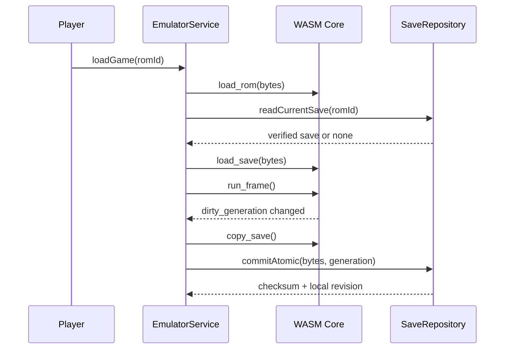

# mGBA 微信 WXWebAssembly 移植开发文档

版本：1.0  
状态：技术设计  
构建环境：Ubuntu 22.04 LTS 裸机

## 1. 目标与原则

本模块把 mGBA 核心编译成微信小程序可加载的 `.wasm`，同时避免复用 gbajs3 当前浏览器构建的平台假设。

必须满足：

- 单线程，不依赖 pthread、SharedArrayBuffer、COOP 或 COEP。
- 不链接 SDL，不访问 window、document、navigator、File、Blob、IndexedDB 或 Web Audio。
- 不使用 WebGL 作为核心依赖；核心只生成内存 framebuffer。
- 不使用 Emscripten IDBFS；文件持久化由 TypeScript/微信文件系统完成。
- ABI 明确版本化，JS 不直接调用 mGBA 内部符号。
- ROM 和存档缓冲的所有权、长度和生命周期可验证。

## 2. 上游与许可证管理

- 从 mGBA 官方仓库选择通过 POC 的稳定 tag 或 commit。
- `minigba-core/vendor/mgba` 以 Git submodule 固定到完整 commit，不跟随分支自动更新。
- 项目补丁放在 `core/patches`，按顺序编号并提供说明。
- `core/UPSTREAM.md` 记录上游 URL、commit、mGBA 版本、Emscripten 版本、补丁摘要和构建 ID。
- 分发物附带 MPL-2.0、mGBA 版权信息及其第三方许可证。
- 对 mGBA 受 MPL 覆盖文件的修改提供对应源码，不把 ROM 或官方 BIOS 混入源码包。

## 3. 构建目标

### 3.1 CMake 配置

微信目标使用独立 toolchain preset，核心方向如下：

```text
BUILD_QT=OFF
BUILD_SDL=OFF
BUILD_GL=OFF
BUILD_GLES2=OFF
BUILD_GLES3=OFF
BUILD_FFMPEG=OFF
BUILD_PYTHON=OFF
BUILD_TEST=OFF
BUILD_STATIC=ON
M_CORE_GBA=ON
M_CORE_GB=OFF
USE_PTHREADS=OFF
```

实际选项名以固定的 mGBA commit 为准；配置阶段必须检查 CMake 输出，发现 SDL、线程或桌面 UI 被意外启用时立即失败。

### 3.2 Emscripten 链接原则

- 优化级别：发布 `-O3`，诊断构建 `-O1 -gsource-map`。
- 启用 LTO 前先完成无 LTO 可调试构建。
- 固定初始内存从 64 MiB 开始，POC 验证是否允许增长。
- 禁用 pthread。
- 只导出 `mgba_wx_*` ABI 函数和必要线性内存。
- 不导出 `FS`、`ccall`、`cwrap` 等通用运行时能力。
- 禁止生成依赖浏览器环境检测的自动启动逻辑。
- 生产发布 `.wasm.br` 时同时保留原始 `.wasm` 供诊断，代码包只包含发布所需版本。

### 3.3 裸机构建命令

构建脚本在 Ubuntu 22.04 上直接调用已固定的 emsdk：

```bash
source /opt/minigba/toolchains/emsdk/emsdk_env.sh
emcmake cmake -S core -B build/core-weapp \
  -DCMAKE_BUILD_TYPE=Release \
  -DMINIGBA_PLATFORM=weapp
cmake --build build/core-weapp --parallel "$(nproc)"
ctest --test-dir build/core-weapp --output-on-failure
```

脚本必须记录编译器版本、上游 commit、补丁集摘要和最终 WASM SHA-256。

## 4. 稳定 C ABI

### 4.1 版本和状态码

```c
#define MGBA_WX_ABI_VERSION 1u

typedef enum MgbaWxStatus {
    MGBA_WX_OK = 0,
    MGBA_WX_ERR_INVALID_ARGUMENT = 1,
    MGBA_WX_ERR_INVALID_STATE = 2,
    MGBA_WX_ERR_OUT_OF_MEMORY = 3,
    MGBA_WX_ERR_BAD_ROM = 4,
    MGBA_WX_ERR_CORE_LOAD = 5,
    MGBA_WX_ERR_SAVE_SIZE = 6,
    MGBA_WX_ERR_STATE_INCOMPATIBLE = 7,
    MGBA_WX_ERR_INTERNAL = 255
} MgbaWxStatus;
```

ABI 函数不得抛出跨越 WASM 边界的异常。失败时返回状态码，并通过固定错误缓冲读取诊断文本。

### 4.2 生命周期 ABI

```c
uint32_t mgba_wx_abi_version(void);
uint32_t mgba_wx_build_id_ptr(void);
uint32_t mgba_wx_build_id_len(void);

MgbaWxStatus mgba_wx_create(uint32_t config_ptr, uint32_t config_len);
MgbaWxStatus mgba_wx_load_rom(uint32_t rom_ptr, uint32_t rom_len);
MgbaWxStatus mgba_wx_reset(void);
MgbaWxStatus mgba_wx_run_frame(void);
MgbaWxStatus mgba_wx_unload_rom(void);
void mgba_wx_destroy(void);
```

约束：

- `create`、`destroy` 可安全失败；`destroy` 幂等。
- `load_rom` 成功后核心停在可加载存档、尚未执行第一帧的状态。
- 不允许 ROM 缓冲在核心仍引用时被 JS 释放；首版优先让核心复制或接管一块专用内存。
- `run_frame` 每次只推进一个视频帧，不包含平台 sleep。

### 4.3 内存分配 ABI

```c
uint32_t mgba_wx_alloc(uint32_t size, uint32_t alignment);
void mgba_wx_free(uint32_t ptr, uint32_t size, uint32_t alignment);
```

- JS 只通过上述接口为 ABI 大缓冲分配内存。
- 所有 `ptr + len` 在 C 侧检查溢出并确认落在线性内存范围。
- 释放时要求原始 size/alignment，诊断构建跟踪重复释放和泄漏。

### 4.4 视频 ABI

```c
typedef struct MgbaWxVideoInfo {
    uint32_t pixels_ptr;
    uint32_t width;
    uint32_t height;
    uint32_t stride_bytes;
    uint32_t format;
    uint64_t frame_number;
} MgbaWxVideoInfo;

MgbaWxStatus mgba_wx_video_info(uint32_t out_ptr, uint32_t out_len);
```

- 首版固定输出 240 x 160 RGBA8888。
- framebuffer 由核心持有并复用，至少保证到下一次 `run_frame` 前有效。
- JS 通过 `Uint8ClampedArray(memory.buffer, ptr, stride * height)` 建视图。
- WASM Memory 增长后旧 TypedArray 失效，适配层必须检测 `memory.buffer` 是否变化并重建视图。

### 4.5 音频 ABI

```c
typedef struct MgbaWxAudioInfo {
    uint32_t sample_rate;
    uint32_t channels;
    uint32_t queued_frames;
    uint32_t capacity_frames;
} MgbaWxAudioInfo;

MgbaWxStatus mgba_wx_audio_info(uint32_t out_ptr, uint32_t out_len);
uint32_t mgba_wx_audio_read(int16_t* dst, uint32_t max_frames);
void mgba_wx_audio_clear(void);
```

- 格式固定为交错双声道 signed 16-bit PCM。
- 初始采样率候选 32768 Hz 或 48000 Hz，由 POC 比较重采样成本和设备稳定性后确定。
- 核心只写环形缓冲，平台按音频回调读取。
- 欠载由平台补零；溢出策略为丢弃最旧帧并计数。

### 4.6 输入 ABI

```c
enum MgbaWxKeyMask {
    MGBA_WX_KEY_A      = 1u << 0,
    MGBA_WX_KEY_B      = 1u << 1,
    MGBA_WX_KEY_SELECT = 1u << 2,
    MGBA_WX_KEY_START  = 1u << 3,
    MGBA_WX_KEY_RIGHT  = 1u << 4,
    MGBA_WX_KEY_LEFT   = 1u << 5,
    MGBA_WX_KEY_UP     = 1u << 6,
    MGBA_WX_KEY_DOWN   = 1u << 7,
    MGBA_WX_KEY_R      = 1u << 8,
    MGBA_WX_KEY_L      = 1u << 9
};

void mgba_wx_set_key_mask(uint32_t mask);
uint32_t mgba_wx_get_key_mask(void);
```

- JS 每次提交完整位图，不发送容易丢失配对的 keydown/keyup 队列。
- 核心对同时出现 Left+Right 或 Up+Down 使用明确策略；默认交给 mGBA 输入层处理。

### 4.7 电池存档 ABI

```c
typedef struct MgbaWxSaveInfo {
    uint32_t save_type;
    uint32_t size_bytes;
    uint64_t dirty_generation;
} MgbaWxSaveInfo;

MgbaWxStatus mgba_wx_save_info(uint32_t out_ptr, uint32_t out_len);
MgbaWxStatus mgba_wx_load_save(uint32_t src_ptr, uint32_t src_len);
MgbaWxStatus mgba_wx_copy_save(uint32_t dst_ptr, uint32_t dst_len);
uint64_t mgba_wx_save_generation(void);
```

- 存档必须在 ROM 加载后、第一帧前注入。
- `dirty_generation` 只在内容实际变化时递增。
- TypeScript 记录上次成功提交 generation，避免每帧比较整块数据。
- 存档大小必须以核心报告为准。

### 4.8 状态存档 ABI

```c
uint32_t mgba_wx_state_max_size(void);
MgbaWxStatus mgba_wx_state_write(
    uint32_t dst_ptr,
    uint32_t dst_capacity,
    uint32_t* written_size
);
MgbaWxStatus mgba_wx_state_read(uint32_t src_ptr, uint32_t src_len);
```

- TypeScript 文件头包装 ROM ID、ABI、核心 build ID、时间和 checksum。
- 状态读取前先由 JS 校验外层文件头，再由核心校验内部格式。
- 状态读取使用临时核心验证或保证失败不改变现有状态；不能接受半应用状态。

## 5. TypeScript 绑定层

### 5.1 加载流程

1. 从独立播放器分包确定 `.wasm` 或 `.wasm.br` 代码包路径。
2. 构造最小 imports，包含受控日志、单调时钟和必要 Emscripten 支持。
3. 调用 `WXWebAssembly.instantiate(path, imports)`。
4. 校验导出的 ABI version、memory 和所有必需函数。
5. 读取 build ID，与小程序构建时记录值比较。
6. 初始化固定 scratch buffer、视频信息结构和音频读取缓冲。
7. 任一步失败都释放已创建资源并返回稳定错误码。

不要通过把 `globalThis.WebAssembly` 简单替换成 `WXWebAssembly` 来运行现成 Emscripten glue；正式实现使用可审计的专用 loader。

### 5.2 类型包装

```ts
interface MgbaWxCore {
  readonly abiVersion: number
  readonly buildId: string
  loadRom(rom: Uint8Array): void
  runFrame(): VideoFrameView
  setKeyMask(mask: number): void
  getSaveInfo(): SaveInfo
  copyBatterySave(): Uint8Array
  loadBatterySave(save: Uint8Array): void
  createState(): Uint8Array
  loadState(state: Uint8Array): void
  readAudio(target: Int16Array): number
  destroy(): void
}
```

包装层把整数状态码转换为领域错误，但不能吞掉原始 core error code。

## 6. 视频实现

### 6.1 Canvas 2D 基线

- 创建一个 240 x 160 的逻辑 Canvas framebuffer。
- 每帧将 WASM framebuffer 复制或视图转换到复用 ImageData。
- 调用 `putImageData` 更新原始画布，再由显示 Canvas 缩放。
- 禁止逐像素 JS 循环；颜色格式不一致时在 C 侧输出正确格式。

### 6.2 WebGL 回退/优化

若 Canvas 2D 不满足性能目标：

- 使用 WebGL 1.0 单纹理、全屏矩形和最近邻采样。
- 每帧仅执行 `texSubImage2D` 和 draw call。
- 不启用滤镜链、shader 预设或离屏多 pass。
- Context lost 时暂停并重建资源，成功后继续。

是否启用 WebGL 由真机能力探测和性能结果决定，不以开发者工具结果决定。

## 7. 音频实现

### 7.1 数据路径

```text
mGBA mixer -> C PCM ring -> WASM audio_read -> JS staging buffer
-> WebAudio ScriptProcessor/可用节点 -> device output
```

### 7.2 同步策略

- 正常速度以视频时钟驱动核心，音频通过缓冲吸收抖动。
- 缓冲目标 40-80 ms，最终值按设备档位验证。
- 缓冲过低不通过加速整台模拟器弥补；缓冲过高不无限累积。
- 快进时默认静音或丢弃多余音频，恢复普通速度时清空环形缓冲。
- WebAudioContext interrupted/suspended 时核心可以继续静音或暂停，由产品设置决定；默认暂停。

### 7.3 音频启动限制

- 音频初始化必须绑定用户触摸动作。
- `resume()` 失败时显示静音状态，不阻止游戏进入。
- 每次从后台回来检测 context 状态，但不在无用户动作时循环调用 resume。

## 8. 帧调度

核心每次执行完整一帧。伪代码：

```ts
function tick(now: number): void {
  if (phase !== 'running') return

  accumulator += clamp(now - previousTime, 0, MAX_DELTA_MS)
  previousTime = now

  let executed = 0
  while (accumulator >= FRAME_DURATION_MS && executed < MAX_CATCH_UP) {
    core.setKeyMask(input.currentMask())
    core.runFrame()
    accumulator -= FRAME_DURATION_MS
    executed += 1
  }

  if (executed > 0) video.present(core.videoFrame())
  scheduleNextFrame(tick)
}
```

注意：

- `previousTime` 使用单调时钟。
- 暂停恢复时清零 accumulator，防止一次补跑后台全部时间。
- 自动帧跳过只跳过 present，不能跳过核心执行。
- 帧率统计使用滑动窗口，不逐帧进入 React store。

## 9. ROM 加载

- ROM 在进入核心前完成大小、Header、hash 和本地路径验证。
- 加载时暂停 UI 导入动作，避免同时加载两份 ROM。
- 大缓冲只保留必要副本；加载成功后释放微信文件读取临时缓冲。
- 核心启用 mGBA 内置 BIOS 实现，不打包官方 BIOS。
- RTC 从平台提供的 UTC/本地时钟桥接，存档 manifest 记录最近观察时间。
- 首版拒绝多 ROM 压缩包；解压在核心外完成并经过大小限制。

## 10. 存档生命周期



进入后台时顺序固定：

1. 将 phase 设置为 paused。
2. 清空按键位图。
3. 停止下一帧调度。
4. 复制电池存档并启动本地原子写入。
5. 可用时间允许时生成自动状态；超时则优先保证电池存档。
6. suspend 音频。

## 11. 内存管理

- 启动后记录 WASM memory 初始大小和高水位。
- ROM 读取、状态写入使用可复用的大块缓冲池。
- 不把 ROM 转成 Base64，不存入 localStorage，不在 JSON 中传输。
- 状态存档可在写盘前分块压缩，但必须测量峰值内存，禁止同时保留多份完整副本。
- 发生微信内存告警时立即暂停，flush 电池存档，清理截图/状态临时缓冲并提示用户。
- destroy 后诊断构建必须确认核心分配计数归零。

## 12. 错误与恢复

| 错误 | 客户端行为 |
| --- | --- |
| ABI 不匹配 | 禁止启动，提示更新小程序 |
| WASM 实例化失败 | 记录设备能力，允许返回游戏库 |
| ROM 无效 | 不创建游戏库条目或将条目标记为隔离 |
| 核心崩溃 | 停止循环、尝试 flush 已有电池存档、销毁核心 |
| Canvas context lost | 暂停并重建 context；失败则退出播放器 |
| 音频初始化失败 | 静音继续，设置页提供重试 |
| 状态不兼容 | 不调用核心读取，保留原文件供导出 |
| 内存不足 | 停止快进/状态操作，保存电池存档并退出播放器 |

## 13. 调试构建

诊断版本额外提供：

- C assertion、边界 canary 和分配统计。
- 最近 120 帧的执行时间、present 时间和音频队列深度。
- 可下载的核心构建信息，不包含 ROM 或存档内容。
- 确定性帧 hash 模式：固定 ROM、输入序列和帧数，输出 framebuffer/hash。
- ABI 自测入口，对 alloc/free、错误缓冲、视频结构和状态往返执行检查。

诊断能力必须通过编译标志关闭，不在生产版本暴露任意内存读取接口。

## 14. POC 技术闸门

只有以下项目全部通过，才进入完整业务开发：

1. Ubuntu 22.04 可重复构建 `.wasm`，产物 hash 和 build ID 可追踪。
2. iOS、Android 微信真机均可通过 WXWebAssembly 实例化。
3. 合法 homebrew ROM 能运行至少 30 分钟，无崩溃和持续内存增长。
4. 画面平均达到 58 FPS 或已证明目标设备分层策略可接受。
5. 音频连续、延迟可接受，后台/前台切换后能恢复。
6. SRAM/Flash/EEPROM 测试 ROM 可写入、退出、重新加载并保持一致。
7. 手动状态存档往返成功，版本不匹配能被拒绝。
8. 不使用 pthread、SDL、DOM、IDBFS、WebGL2 和虚拟化构建环境。
