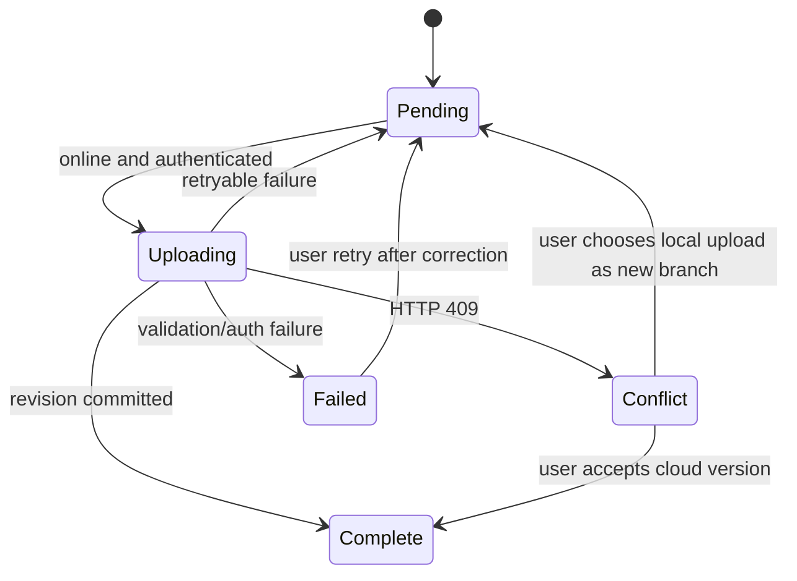

# ROM、存档与云同步开发文档

版本：1.0  
状态：技术设计  
服务端环境：Ubuntu 22.04 LTS 裸机

## 1. 设计目标

- ROM、存档和状态存档按内容身份隔离，杜绝同名串档。
- 本地是游玩的首要数据源；云端故障不影响本地保存。
- 所有写入可恢复，任何失败都保留上一成功版本。
- 云端并发使用 revision 检测，永不静默覆盖冲突存档。
- 云端默认不上传 ROM，只保存用户明确允许的存档数据。
- 用户可以导出、删除并理解自己的数据。

## 2. 数据分类

| 类型 | 是否敏感 | 默认本地 | 默认上云 | 标识方式 |
| --- | --- | --- | --- | --- |
| ROM | 版权内容 | 是 | 否 | ROM 原始字节 SHA-256 |
| 电池存档 | 用户游戏进度 | 是 | 用户开启后是 | ROM ID + `battery` |
| 状态存档 | 完整运行状态 | 是 | 默认否 | ROM ID + slot + build ID |
| 截图 | 用户生成内容 | 是 | 否 | 随机 ID + checksum |
| 设置 | 用户偏好 | 是 | 可选 | 用户/匿名配置版本 |
| 诊断 | 设备和运行指标 | 临时 | 用户提交后是 | report ID |
| 登录会话 | 身份凭证 | 本地安全存储 | 服务端摘要 | session ID |

## 3. 本地目录布局

根目录使用微信 `USER_DATA_PATH/minigba`，不得依赖临时路径长期存在。

```text
minigba/
  library.json
  play-history.json
  settings/<account-scope>.json
  sync/<account-scope>/queue.json
  roms/
    ab/cd/<romId>.gba
  saves/
    <romId>/
      battery/current/current.bin
      battery/current/manifest.json
      state/<slot>/current.bin
      state/<slot>/manifest.json
      state/<slot>/preview.png
      auto_state/auto/current.bin
  screenshots/
    <romId>/<timestamp>-<random>.png
  quarantine/
  tmp/
```

`ab/cd` 是 ROM ID 前四个字符的两级分片，避免单目录文件过多。

规则：

- 用户文件名只作为显示元数据，不进入实际路径。
- 所有路径由 repository 通过受控 ID 生成。
- `tmp` 启动时清理超过 24 小时且没有恢复标记的文件。
- `quarantine` 保存索引损坏或 checksum 不一致的文件，用户确认后才删除。
- 正式文件和临时文件必须位于同一目录，确保 rename 具备原子语义。

## 4. 游戏库索引

`library.json` 只保存小型元数据，不内嵌二进制：

```json
{
  "schemaVersion": 1,
  "entries": [
    {
      "romId": "64-char-sha256",
      "displayName": "My Homebrew Game",
      "romPath": "roms/ab/cd/64-char-sha256.gba",
      "romSize": 1048576,
      "gameCode": "ABCD",
      "headerTitle": "HOMEBREW",
      "importedAt": "2026-07-28T01:00:00.000Z",
      "lastPlayedAt": null,
      "favorite": false,
      "source": "wechat-message-file"
    }
  ]
}
```

写索引同样采用 `library.json.tmp -> fsync/close -> rename`。解析失败时从文件系统重建，不直接删除未知文件。

## 5. ROM 身份和导入

### 5.1 ROM ID

ROM ID 是最终交给核心的未压缩、未打补丁 ROM 字节 SHA-256。文件名、Header Title 和 Game Code 不能作为唯一键。

补丁派生 ROM 的元数据额外记录：

```json
{
  "baseRomId": "...",
  "patchId": "...",
  "patchType": "bps",
  "resultRomId": "..."
}
```

存档只匹配 `resultRomId`，防止不同补丁版本共享不兼容存档。

### 5.2 导入步骤

1. 从 Taro 文件选择或下载接口取得临时路径和声明大小。
2. 拒绝大小为 0 或超过 32 MiB 的原始 `.gba`。
3. 分块读取并计算 SHA-256，同时捕获前 192 字节 Header。
4. 验证 GBA Header 基本结构，生成风险提示。
5. 查找现有 ROM ID；存在时只更新显示元数据。
6. 写入目标目录临时文件，重新读取计算 hash。
7. hash 一致后 rename 为正式文件。
8. 原子更新游戏库索引。
9. 删除微信临时文件只在平台允许且由本应用创建时进行。

### 5.3 ZIP 处理

ZIP 是 P1，必须执行：

- 压缩包上限和解压后总大小上限。
- 压缩比上限，默认 100:1。
- 条目数上限，默认 32。
- 拒绝绝对路径、`..`、符号链接和非普通文件。
- 只允许一个候选 `.gba`；多个候选要求用户选择，不自动猜测。
- 解压到应用 `tmp`，校验完成后再提交正式 ROM。

### 5.4 R2 ROM 目录与下载

R2 公共域名只暴露不可变 ROM、封面和一个小型目录 manifest。客户端不调用 S3 ListObjects，不包含 access key，也不从对象名猜测 SHA-256、大小或授权状态。

```text
catalog/v1/roms.json
roms/<romId>.gba
covers/<romId>.<content-hash>.webp
```

客户端处理顺序：

1. 校验 `TARO_APP_ROM_CATALOG_URL` 使用 HTTPS 且 host 在 `TARO_APP_ROM_DOWNLOAD_HOSTS`。
2. 获取 JSON 后一次性验证 schema、生成时间、bucket、最多 500 项和每项分发许可。
3. 将相对对象 URL 基于 manifest URL 解析，再次检查 HTTPS、无凭证、无 fragment 和 host allowlist。
4. 仅缓存完整通过验证的目录；新目录失败时保留旧缓存并标为 stale。
5. 用户选择条目后通过 `downloadFile` 下载，验证 HTTP 200、声明长度、落盘长度、SHA-256 和 GBA Header。
6. 使用 ROM ID 分片路径原子提交，更新本地 catalog 元数据；失败时不创建半成品索引。

ROM 对象使用内容寻址和长期 immutable cache；`roms.json` 使用短缓存并可原子替换。完整字段和发布步骤见 `12-r2-rom-catalog.md`。

### 5.5 游玩记录

`play-history.json`：

```json
{
  "schemaVersion": 1,
  "sessions": [
    {
      "id": "123e4567-e89b-42d3-a456-426614174000",
      "romId": "64-char-sha256",
      "startedAt": "2026-08-01T12:00:00.000Z",
      "endedAt": "2026-08-01T12:23:45.000Z",
      "durationSeconds": 1280,
      "exitReason": "background"
    }
  ]
}
```

- 最多保留按结束时间倒序的 500 项。
- 同一 session ID 的暂停/后台 checkpoint 使用 upsert，不追加重复记录。
- 累计时长只增加相对上次 checkpoint 的差值，暂停和后台驻留不计时。
- 当前索引损坏时优先读取 `.previous`；两者均无效时回退为空历史，不扫描或删除 ROM、存档。
- 会话明细、游戏累计时长、ROM 和存档分别删除，避免一个管理动作隐式擦除其他数据。

## 6. 电池存档格式

### 6.1 Manifest

```json
{
  "schemaVersion": 1,
  "romId": "64-char-sha256",
  "kind": "battery",
  "saveType": "flash128k",
  "size": 131072,
  "checksum": "64-char-sha256",
  "coreBuildId": "mgba-commit.patchset.abi1",
  "coreGeneration": 42,
  "localRevision": 18,
  "cloudRevision": 12,
  "createdAt": "2026-07-28T01:00:00.000Z",
  "updatedAt": "2026-07-28T02:00:00.000Z",
  "lastUploadedAt": null
}
```

`localRevision` 每次本地成功提交递增。`cloudRevision` 表示当前本地版本所基于的云端 revision，两者不可混用。

### 6.2 原子提交算法

```text
validate core-reported size
write battery.sav.tmp
close and sync where platform supports it
read back temporary file
verify size and SHA-256
move battery.sav to battery.sav.prev
rename battery.sav.tmp to battery.sav
write and atomically replace manifest
enqueue cloud sync after local commit succeeds
```

如果正式文件移到 `.prev` 后最后 rename 失败，恢复逻辑将 `.prev` 放回正式位置。manifest 永远不能指向尚未提交的 checksum。

### 6.3 防抖

- 核心 `dirty_generation` 变化时标记 dirty。
- 第一次变化后最晚 5 秒提交。
- 高频变化合并为一次写入，但每 30 秒至少检查一次。
- 页面隐藏、安全退出和手动同步绕过防抖。
- 同 ROM 同时最多一个 commit；新变化在当前 commit 完成后再提交。

## 7. 状态存档格式

状态文件为固定头加 mGBA payload：

```text
Offset  Size  Field
0       8     Magic "MGBSTATE"
8       2     Container version, little-endian
10      2     Header size
12      4     Flags
16      32    ROM SHA-256 raw bytes
48      32    Payload SHA-256 raw bytes
80      8     Created Unix milliseconds
88      4     Core ABI version
92      2     Build ID length
94      N     UTF-8 build ID
...     4     Payload length
...     M     mGBA state payload
```

规则：

- Header 和 payload 有明确长度上限。
- 加载前检查 Magic、版本、ROM ID、build ID、长度和 payload checksum。
- 自动状态槽不覆盖手动槽。
- 状态不兼容时保留文件，不尝试强制转换。
- 状态截图为旁路文件，不影响状态正文有效性。

## 8. 同步队列

### 8.1 任务结构

```json
{
  "schemaVersion": 1,
  "tasks": [
    {
      "taskId": "uuid",
      "operation": "upload",
      "romId": "...",
      "kind": "battery",
      "slot": null,
      "localRevision": 18,
      "baseCloudRevision": 12,
      "checksum": "...",
      "attempt": 0,
      "notBefore": "2026-07-28T02:01:00.000Z",
      "createdAt": "2026-07-28T02:00:00.000Z"
    }
  ]
}
```

### 8.2 状态机



### 8.3 合并规则

- 同一 `(romId, kind, slot)` 的多个待上传任务只保留最新本地 revision。
- 正在上传时产生新版本，不修改正在发送的 body；完成后立即排队新任务。
- 同 checksum 重复提交视为幂等成功。
- 删除任务不与上传任务交换顺序；删除前取消相同键的待上传任务。

## 9. 云 API

统一前缀 `/v1`，请求和响应时间为 UTC。

| 方法 | 路径 | 用途 |
| --- | --- | --- |
| POST | `/v1/auth/wechat/login` | 微信 code 换取应用会话 |
| POST | `/v1/auth/refresh` | 刷新 access token |
| POST | `/v1/auth/logout` | 撤销当前会话 |
| GET | `/v1/saves` | 列出用户所有存档头 |
| GET | `/v1/saves/{romId}` | 列出一个 ROM 的存档和版本 |
| PUT | `/v1/saves/{romId}/{kind}/{slot}` | 上传新 revision |
| GET | `/v1/saves/{romId}/{kind}/{slot}/content` | 下载当前正文 |
| GET | `/v1/saves/{romId}/{kind}/{slot}/versions/{revision}` | 下载历史版本 |
| POST | `/v1/saves/{romId}/{kind}/{slot}/restore` | 将历史版本复制为新 revision |
| DELETE | `/v1/saves/{romId}/{kind}/{slot}` | 逻辑删除一个存档头 |
| DELETE | `/v1/saves/{romId}` | 删除一个 ROM 的全部云存档 |
| POST | `/v1/account/deletion` | 发起账号数据删除 |
| GET | `/v1/account/deletion` | 查询删除进度 |
| GET | `/health/live` | 进程存活，仅本机/监控使用 |
| GET | `/health/ready` | 数据库和 blob 可用性 |

`slot` 对 battery 固定为 `current`，对手动状态为 `0..4`，自动状态为 `auto`。

### 9.1 上传请求

元数据通过请求头传递，正文为二进制，避免 Base64：

```text
PUT /v1/saves/{romId}/battery/current
Authorization: Bearer <access-token>
Content-Type: application/octet-stream
Content-Length: 131072
If-Match: "revision-12"
X-Content-SHA256: <sha256>
X-Core-Build-ID: <build-id>
X-Device-ID: <uuid>
Idempotency-Key: <uuid>
```

成功：

```json
{
  "romId": "...",
  "kind": "battery",
  "slot": "current",
  "revision": 13,
  "checksum": "...",
  "createdAt": "2026-07-28T02:00:00.000Z"
}
```

冲突返回 HTTP 409：

```json
{
  "error": {
    "code": "SAVE_CONFLICT",
    "message": "Cloud save has changed",
    "requestId": "...",
    "details": {
      "currentRevision": 14,
      "currentChecksum": "...",
      "currentUpdatedAt": "2026-07-28T02:05:00.000Z",
      "currentDeviceName": "iPhone"
    }
  }
}
```

### 9.2 下载

- 响应包含 Content-Length、ETag、X-Content-SHA256、X-Revision 和 Cache-Control: private, no-store。
- 客户端下载到临时文件，验证 header 与实际内容后再提交本地 repository。
- 中断下载不得改变现有本地存档。

## 10. PostgreSQL 数据模型

核心表：

```sql
CREATE TABLE users (
    id uuid PRIMARY KEY,
    wechat_subject_hash bytea NOT NULL UNIQUE,
    status text NOT NULL CHECK (status IN ('active', 'deleting', 'deleted')),
    created_at timestamptz NOT NULL DEFAULT now(),
    updated_at timestamptz NOT NULL DEFAULT now(),
    deleted_at timestamptz
);

CREATE TABLE devices (
    id uuid PRIMARY KEY,
    user_id uuid NOT NULL REFERENCES users(id),
    client_device_id uuid NOT NULL,
    display_name text NOT NULL,
    last_seen_at timestamptz NOT NULL,
    created_at timestamptz NOT NULL DEFAULT now(),
    UNIQUE (user_id, client_device_id)
);

CREATE TABLE save_heads (
    id uuid PRIMARY KEY,
    user_id uuid NOT NULL REFERENCES users(id),
    rom_id char(64) NOT NULL,
    kind text NOT NULL CHECK (kind IN ('battery', 'state', 'auto_state')),
    slot text NOT NULL,
    current_revision bigint NOT NULL DEFAULT 0,
    deleted_at timestamptz,
    created_at timestamptz NOT NULL DEFAULT now(),
    updated_at timestamptz NOT NULL DEFAULT now(),
    UNIQUE (user_id, rom_id, kind, slot)
);

CREATE TABLE save_versions (
    id uuid PRIMARY KEY,
    save_head_id uuid NOT NULL REFERENCES save_heads(id),
    revision bigint NOT NULL,
    checksum char(64) NOT NULL,
    blob_digest char(64) NOT NULL,
    size_bytes bigint NOT NULL CHECK (size_bytes > 0),
    core_build_id text NOT NULL,
    device_id uuid REFERENCES devices(id),
    created_at timestamptz NOT NULL DEFAULT now(),
    deleted_at timestamptz,
    UNIQUE (save_head_id, revision)
);

CREATE TABLE blobs (
    digest char(64) PRIMARY KEY,
    size_bytes bigint NOT NULL CHECK (size_bytes > 0),
    reference_count bigint NOT NULL CHECK (reference_count >= 0),
    created_at timestamptz NOT NULL DEFAULT now(),
    delete_after timestamptz
);

CREATE TABLE idempotency_keys (
    user_id uuid NOT NULL REFERENCES users(id),
    key uuid NOT NULL,
    request_hash char(64) NOT NULL,
    response_status integer NOT NULL,
    response_body jsonb NOT NULL,
    expires_at timestamptz NOT NULL,
    PRIMARY KEY (user_id, key)
);
```

另设 `sessions`、`audit_events`、`deletion_jobs` 和 `schema_migrations`。所有按用户查询的表必须有 `user_id` 前导索引；保留清理任务使用 `created_at/deleted_at` 索引。

## 11. 服务端上传事务

上传顺序：

1. 验证鉴权、路径参数、header、大小和用户配额。
2. 流式写 `/srv/minigba/tmp/<request-id>`，同时计算 SHA-256。
3. 对比声明 checksum，失败则删除临时文件。
4. 开启数据库事务，`SELECT ... FOR UPDATE` 锁定 save head。
5. 对比 `If-Match` revision；不一致回滚并返回 409。
6. 将临时文件原子移动到内容寻址 blob 路径；已存在则复用。
7. 新增/增加 blob 引用，插入 save version，更新 save head revision。
8. 写审计事件和幂等结果，提交事务。
9. 返回新 revision。

文件已移动但数据库提交失败时，文件成为无引用 blob，由延迟垃圾回收任务处理。绝不在请求失败路径直接删除可能已被其他事务引用的内容摘要文件。

## 12. 冲突处理

冲突界面提供：

- 本地版本：本地时间、local revision、基于的 cloud revision、checksum、大小。
- 云端版本：revision、服务端时间、设备名称、checksum、大小。
- 操作：“保留本地并另存云端新版本”“使用云端并备份本地”“暂不处理”。

处理规则：

- 使用云端前把当前本地版本保存为 `.conflict-<timestamp>`。
- 保留本地时先下载并保存云端冲突副本，再以当前云 revision 为 base 上传本地内容。
- checksum 相同即自动合并，无需用户确认。
- 设备时钟只用于展示，不决定胜负。

## 13. 配额与保留

初始建议值，最终由运营配置：

- 单个 battery save：不超过 1 MiB。
- 单个 state：不超过 8 MiB。
- 每个用户云存档总量：100 MiB。
- battery 历史：最近 10 个或 30 天。
- state 历史：每个槽最近 3 个或 14 天。
- 删除后的恢复窗口：7 天；用户明确执行永久删除时可缩短。

配额检查在读取完整 body 前执行声明大小预检，在流式读取后再次按真实大小确认。

## 14. 删除和账号注销

- 单存档删除先标记 save head，历史版本进入延迟删除。
- ROM 级删除覆盖该用户/ROM 下全部 head。
- 账号删除撤销所有会话，标记用户 deleting，后台分批解除 blob 引用并写审计。
- 公共内容摘要 blob 只有引用计数为 0 且超过 delete_after 后才删除。
- 删除任务幂等，可在进程重启后继续。
- 完成后只保留法律或安全要求的最小审计记录，且不保留存档正文。

## 15. 数据迁移

- 本地 schemaVersion 每次只做向前迁移，迁移前复制索引备份。
- 大文件不随索引迁移重复复制，必要时以增量游标执行。
- 服务端迁移使用版本化 SQL，部署新 API 前先执行向后兼容迁移。
- 删除列或收紧约束至少跨两个发布版本执行：先双写/回填，再停止读取，最后清理。
- 核心 build ID 更新不自动转换状态存档；电池存档继续兼容时需有回归测试证明。
