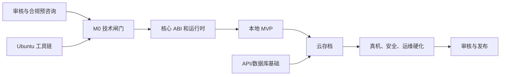

# MiniGBA 项目实施与交付计划

版本：1.0  
状态：规划基线  
唯一构建和服务端环境：Ubuntu 22.04 LTS 裸机

## 1. 交付策略

项目采用“技术闸门优先、存档可靠性优先、云功能后置”的策略。最早阶段先证明 WXWebAssembly、Canvas、音频和存档在真机可行；技术闸门未通过时不并行铺开完整 UI 和后台，以控制返工。

## 2. 建议团队

| 角色 | 建议投入 | 职责 |
| --- | ---: | --- |
| 技术负责人/C-WASM | 1 人 | mGBA fork、ABI、性能、核心升级和跨模块决策 |
| Taro 客户端 | 1-2 人 | 页面、平台适配、触控、文件系统、播放器和同步队列 |
| Go 后端/运维 | 1 人 | 身份、API、PostgreSQL、blob、Ubuntu 发布和备份 |
| QA/自动化 | 1 人 | ROM 测试集、真机矩阵、故障、性能和验收报告 |
| 产品/合规 | 兼职但持续 | 范围、审核预咨询、隐私、版权和发布材料 |

最低配置可以由 2 名高级工程师兼任，但日历时间和单点风险会显著增加。

## 3. 里程碑

### M0：合规确认和技术探针，1-2 周

目标：在投入完整开发前验证平台允许性和最危险技术假设。

交付物：

- 微信类目、审核、ROM 导入和云存档的预咨询结论。
- 固定 mGBA commit、Emscripten 版本和许可证清单。
- Ubuntu 22.04 裸机 core build 脚本。
- 最小 WXWebAssembly loader。
- 一个合法 homebrew ROM 的画面 POC。
- 初始真机能力报告和继续/停止建议。

退出条件：

- iOS、Android 真机均能实例化 WASM。
- 不依赖 pthread、SDL、DOM、IDBFS 和 WebGL2。
- ROM 能连续运行 10 分钟且画面正确。
- 合规没有已知不可解除阻断。

### M1：可运行模拟器核心，2-3 周

交付物：

- ABI v1 和 TypeScript 包装层。
- FrameScheduler、Canvas 2D 基线和 WebGL 实验结果。
- AudioAdapter 与固定 PCM 环形缓冲。
- 输入位图和多点触控原型。
- SRAM/Flash/EEPROM 往返。
- 30 分钟性能、内存和后台恢复报告。

退出条件：`03-emulator-porting.md` 的 POC 技术闸门全部通过。

### M2：本地 MVP，3-4 周

交付物：

- Taro 游戏库、导入、播放器、快捷菜单和设置页面。
- ROM hash、Header 校验、本地索引和重复检测。
- 完整虚拟控制、横竖屏和安全区。
- 电池存档原子提交、previous 恢复、导入/导出。
- 5 个手动状态槽、自动状态和兼容性拒绝。
- 本地诊断和存储管理。

退出条件：全部本地 P0 需求完成，强杀微信后存档恢复测试通过。

### M3：身份和云存档，3-4 周

交付物：

- 微信登录、短期 token、设备会话和登出。
- PostgreSQL schema、迁移、Go API 和文件 BlobStore。
- 持久同步队列、幂等、revision、历史和冲突 UI。
- 用户导出、单游戏删除和账号删除任务。
- Nginx、systemd、日志、速率限制和 staging 发布。

退出条件：双设备离线分叉、冲突和恢复测试通过，无跨用户访问。

### M4：硬化和发布准备，2-3 周

交付物：

- 完整 ROM 兼容测试集和真机矩阵。
- 性能优化、音频调优、内存告警和故障恢复。
- 安全测试、SBOM、许可证、隐私和用户协议。
- 备份、恢复、发布和回滚演练。
- `miniprogram-ci` 上传和候选版本验收报告。

退出条件：发布检查表和验收报告全部通过。

### M5：审核、灰度和正式发布，1-2 周或按平台反馈

交付物：

- 微信审核版本和所需资质材料。
- 灰度用户监控、崩溃和存档专项观察。
- 正式版本、发布记录和应急回退方案。

审核周期和政策整改不纳入纯研发工时承诺。

## 4. 总体估算

在 3-4 名核心工程人员并行投入、M0 技术闸门通过的前提下：

- 工程投入：约 18-28 人周。
- 日历周期：约 12-16 周。
- 单人串行开发：风险过高，预计不低于 5-7 个月。

估算不包括获取 ROM/IP 授权、版号或其他外部资质的时间。

## 5. 工作分解

### 5.1 Core/WASM

- 建立 mGBA fork 和上游追踪。
- 去除 SDL、线程、IDBFS 和浏览器平台层。
- 实现 ABI、线性内存、视频、音频、输入、save 和 state。
- 构建 metadata、许可证包和确定性测试器。
- 真机性能剖析和核心升级流程。

### 5.2 Taro 客户端

- 平台 API 门面和能力探测。
- 游戏库、导入、索引、存储配额。
- 播放器、Canvas、音频、多点触控和布局。
- 存档 repository、状态槽、恢复和数据导出。
- 登录、同步队列、冲突、设置、诊断和删除。

### 5.3 后端

- Go 项目骨架、错误模型和配置。
- 微信登录、session 和 token 轮换。
- PostgreSQL migration 和 SaveService。
- 文件 BlobStore、幂等、revision 和保留清理。
- 审计、删除、健康检查和维护命令。

### 5.4 Ubuntu 运维

- Build/API Host bootstrap。
- 固定 Node、Go、emsdk 和 mGBA 版本。
- Nginx、systemd、PostgreSQL、权限和防火墙。
- CI 裸机 runner、发布、回滚、备份和恢复。
- 监控、告警、证书和容量管理。

### 5.5 QA/合规

- 合法测试 ROM manifest。
- 自动化、真机、性能和故障矩阵。
- ROM 版权、开源许可证、隐私和微信审核材料。
- 候选版本验收和发布后观察。

## 6. 依赖关系

UI 视觉设计可以在 M1 并行，但播放器正式实现必须等待 ABI 和真机结论稳定。

## 7. 技术闸门

### Gate A：平台允许性

- ROM 导入和模拟器形态获得可执行的审核判断。
- 版权策略、隐私和云存档范围明确。
- 失败结果：暂停公开产品，评估仅自研 homebrew 或内部测试用途。

### Gate B：WXWebAssembly

- iOS/Android 均能加载固定核心。
- 包大小、内存和基础库要求可接受。
- 失败结果：不继续完整 Taro 产品；不得退回现成 gbajs3 浏览器包假装解决。

### Gate C：实时体验

- 帧率、输入、音频和 30 分钟稳定性达标。
- 失败结果：比较 Canvas 2D/WebGL、内存和调度；仍失败则重新定义最低设备或终止。

### Gate D：数据可靠性

- battery/state 在强杀、磁盘不足和升级场景不丢失。
- 失败结果：禁止进入云同步和公开测试。

### Gate E：云一致性

- 幂等、冲突、跨设备、删除和备份恢复通过。
- 失败结果：首版降级为纯本地，不带不可靠云存档发布。

## 8. 风险清单

| 风险 | 概率 | 影响 | 缓解 |
| --- | --- | --- | --- |
| 微信审核不接受模拟器或 ROM 广场 | 高 | 致命 | M0 预咨询；广场只含逐项授权内容；不接受用户上传或未授权商业 ROM |
| R2 目录误发布无授权/错误对象 | 中 | 致命 | 双人权利审核、内容寻址 key、远程 manifest 门禁、短目录缓存和紧急下架演练 |
| R2 公共域名或微信合法域名配置错误 | 中 | 高 | 自定义域名基线、request/download 双域名验证、双端真机弱网与缓存回退 |
| mGBA WASM 在低端 Android 不达标 | 中高 | 高 | 单线程瘦身、Canvas/WebGL 对比、最低设备闸门 |
| WebAudio 延迟或恢复不稳定 | 中高 | 高 | 多缓冲档位、静音降级、真机矩阵 |
| WASM 代码包或内存超限 | 中 | 高 | 功能裁剪、`.wasm.br`、独立分包、早期测量 |
| 状态存档跨版本不兼容 | 高 | 中 | build ID 强校验；电池存档为主要云资产 |
| 多设备静默覆盖 | 中 | 高 | base revision、409、冲突副本和幂等 |
| ROM/ZIP 恶意输入 | 中 | 高 | 首版仅 `.gba`；严格大小、路径和解析边界 |
| 单机数据盘故障 | 中 | 高 | 独立备份目标、恢复演练、容量告警 |
| 工具链升级导致不可复现 | 中 | 中 | 固定版本、checksum、裸机干净构建 |
| 核心工程师单点 | 中 | 高 | ABI/补丁文档、代码评审、至少两人能发布核心 |

风险 owner 每周更新概率、影响、触发信号和行动项。

## 9. 范围优先级

### P0：不可缺少

- R2 授权 ROM 广场、`.gba` 导入、本地库、游戏详情、游玩记录、mGBA 核心、画面、音频、完整 GBA 按键。
- 电池存档、本地原子写入、状态槽、后台安全暂停。
- 登录、云电池存档、revision、冲突、历史和删除。
- Ubuntu 22.04 裸机部署、HTTPS、备份恢复、安全和合规。

### P1：首版后可短期补齐

- ZIP、补丁、状态截图、布局自定义、快进、云状态存档。
- 诊断包、更多显示/音频档位。

### P2：未来评估

- 倒带、作弊码、传感器、外接手柄保证、GB/GBC、联机。

P1/P2 不得阻塞或削弱 P0 存档可靠性。

## 10. 迭代管理

- 两周一个迭代；M0/M1 可采用一周技术冲刺。
- 每项任务必须关联需求 ID、设计章节和测试用例。
- 每周至少一次真机集成，不允许在里程碑末尾才首次真机运行。
- 涉及 ABI、文件格式、数据库、鉴权和发布的变更必须有 owner 审查。
- 设计偏离文档时先记录 ADR，再实施和同步修改文档。

## 11. Definition of Ready

开发项进入迭代前必须：

- 有明确需求 ID、优先级和用户结果。
- 输入、输出、错误和数据所有权明确。
- 依赖和平台 API 已确认。
- 有可执行验收标准和测试数据来源。
- 涉及合规或删除的行为已由对应负责人确认。

## 12. Definition of Done

功能完成必须：

- 代码合并、格式/lint/测试全部通过。
- Ubuntu 22.04 构建可重复。
- iOS/Android 受影响真机场景通过。
- 错误、日志、指标和用户提示完成。
- 没有新增敏感数据或未记录依赖。
- 需求、开发、测试和部署文档同步更新。
- 存档格式/API/schema 变更具备兼容和迁移策略。

版本完成还必须满足 `01-product-requirements.md` 和 `06-testing-and-acceptance.md` 的发布验收。

## 13. 变更控制

以下属于重大变更，必须新增 ADR 并重新估算：

- 从普通小程序改为小游戏或增加其他平台。
- 更换 mGBA、启用 pthread 或引入第二模拟器核心。
- 云端开始接收 ROM。
- 改变 ROM ID、状态文件头、revision 或删除语义。
- PostgreSQL/本地文件系统改为其他持久化系统。
- 服务端操作系统不再限定 Ubuntu 22.04。
- 引入任何容器或虚拟化构建/部署方式。

最后一项与当前项目硬约束冲突，不应批准；若业务未来改变约束，必须创建独立版本规划，不能悄悄混入现有文档。

## 14. 发布后计划

发布后 72 小时：

- 每日检查崩溃、内存告警、音频欠载、存档失败和同步冲突。
- 暂停非必要发布，保持快速回滚能力。
- 对所有存档损坏报告按 Critical 处理。

首月：

- 每周真机性能抽样和备份恢复验证。
- 根据实际设备分布调整最低支持范围。
- 评估 P1 的 ZIP、补丁、布局自定义和云状态存档。
- 只有 P0 稳定性指标达标后才开始倒带、作弊码或其他复杂核心功能。
