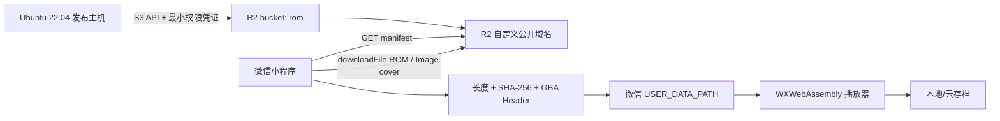

# Cloudflare R2 ROM 广场开发与发布文档

版本：1.0
状态：待接入真实 R2 域名与对象清单
更新日期：2026-08-01

## 1. 目标与边界

ROM 广场允许小程序读取运营方在 Cloudflare R2 上发布的只读授权目录，并把用户选择的 ROM 下载到微信本地文件系统。R2 不保存用户私有 ROM、用户存档、微信身份或云同步数据。

该能力只适用于自研 homebrew、明确允许再分发的作品或运营方取得书面分发授权的 ROM。公开目录不是任意对象列表，也不能把“桶里已有文件”直接等同于“允许公开分发”。

## 2. 组件与信任边界



- 发布主机拥有最小权限 R2 写凭证，小程序没有任何 R2 凭证。
- 小程序只信任构建时白名单中的精确 HTTPS host。
- manifest 是不可信网络输入；只有整个文件和全部条目通过校验后才替换缓存。
- ROM 正文必须在本地再次计算 SHA-256，不能只信任 ETag、文件名或 HTTP header。

## 3. R2 对象布局

推荐使用内容身份稳定的 key：

```text
catalog/v1/roms.json
catalog/v1/archive/roms-20260801T120000Z.json
roms/<64-char-rom-sha256>.gba
covers/<64-char-rom-sha256>.<cover-content-hash>.webp
rights/<64-char-rom-sha256>/notice.txt        # 不公开或独立受控保存
```

约束：

- `roms/` 文件名只使用 ROM SHA-256，不使用标题、用户输入或原始文件名。
- `covers/` 使用内容 hash，更新封面产生新 key，避免不可控 CDN 旧缓存。
- `catalog/v1/roms.json` 是唯一客户端入口；不得让客户端调用 S3 ListObjects。
- `rights/` 权利证据默认不放公共域名；内部记录必须能从 ROM ID 追溯。
- 同一 ROM ID 的正文不可覆盖成不同字节；正文变化必须产生新的 ROM ID。

## 4. Manifest 契约

完整示例位于 `minigba-app/catalog.example.json`。

```json
{
  "schemaVersion": 1,
  "generatedAt": "2026-08-01T12:00:00.000Z",
  "bucket": "rom",
  "items": [
    {
      "romId": "64-char-lowercase-sha256",
      "title": "Authorized Homebrew",
      "gameCode": "DEMO",
      "downloadUrl": "../../roms/<romId>.gba",
      "sizeBytes": 262144,
      "description": "Short player-facing description.",
      "genres": ["Homebrew", "Adventure"],
      "region": "World",
      "language": "English",
      "coverUrl": "../../covers/<romId>.<coverHash>.webp",
      "featured": true,
      "updatedAt": "2026-08-01T11:30:00.000Z",
      "license": {
        "name": "CC BY 4.0",
        "url": "https://author.example/license",
        "notice": "Published with attribution permission."
      }
    }
  ]
}
```

### 4.1 必填字段

| 字段 | 规则 |
| --- | --- |
| `schemaVersion` | 当前只能为整数 `1` |
| `generatedAt` | 可解析的 ISO 8601 时间 |
| `bucket` | 非空，当前预期为 `rom` |
| `items` | 数组，最多 500 项 |
| `romId` | ROM 正文 SHA-256，64 位小写十六进制，目录内唯一 |
| `title` | 1–80 字符 |
| `downloadUrl` | HTTPS 绝对 URL 或相对 manifest URL，解析后 host 必须在白名单 |
| `sizeBytes` | 精确整数，192 B–32 MiB |
| `license.name` | 可审计的分发许可/授权名称，不得写“unknown”代替审核 |

### 4.2 可选字段

- `gameCode` 最多 12 字符，用于显示，不是身份。
- `description` 最多 240 字符。
- `genres` 最多 8 项，每项最多 24 字符。
- `region`、`language` 用于筛选和详情展示。
- `coverUrl` 必须符合与 ROM 相同的 URL/host 规则。
- `featured` 仅影响排序，不绕过校验。
- `updatedAt` 是条目元数据更新时间，不参与 ROM 身份。
- `license.url` 必须是无凭证、无 fragment 的 HTTPS URL；客户端只显示许可名称，不自动跳转。

## 5. Cloudflare Dashboard 配置基线

在 `R2 > rom > Settings` 中核对并记录以下值：

1. 自定义公开域名，例如 `roms.example.com`。生产不把临时开发域名作为长期发布契约。
2. Public access 只覆盖需要公开的目录；任何内部权利证据和临时上传对象不得位于公开路径。
3. Cache：ROM 和内容寻址封面设置 `public, max-age=31536000, immutable`；`catalog/v1/roms.json` 设置 `public, max-age=300, must-revalidate`。
4. MIME：ROM 使用 `application/octet-stream`，manifest 使用 `application/json; charset=utf-8`，封面使用实际图片类型。
5. 若配置 CORS，只开放 `GET`、`HEAD` 和必要响应头；CORS 不是鉴权机制，也不能替代微信合法域名或客户端 SHA-256 校验。
6. S3/API token 仅授予目标 bucket 和必要的 list/put/delete 权限；生产发布凭证与人工 Dashboard 登录分离。

当前真实公开域名、CORS 和对象列表必须从 Dashboard 再次核实后才能写入生产环境。不得从 account ID 和 bucket 名猜测公共 URL。

## 6. 微信公众平台配置

在小程序后台配置：

- `request` 合法域名：manifest 所在自定义域名。
- `downloadFile` 合法域名：ROM 和封面实际 host；若与 manifest 相同只需一个域名。
- 云存档 API 的 `request` 合法域名仍独立配置。

发布环境变量：

```bash
export TARO_APP_API_BASE_URL=https://api.example.com
export TARO_APP_ROM_CATALOG_URL=https://roms.example.com/catalog/v1/roms.json
export TARO_APP_ROM_DOWNLOAD_HOSTS=roms.example.com
```

`TARO_APP_ROM_DOWNLOAD_HOSTS` 只包含逗号分隔的精确 `host[:port]`，不包含 scheme、路径或通配符。

## 7. Ubuntu 22.04 发布流程

本节只允许在 Ubuntu 22.04 裸机执行，不使用 Docker、WSL、虚拟机或其他虚拟化。

### 7.1 准备对象

```bash
sha256sum authorized-homebrew.gba
stat -c '%s' authorized-homebrew.gba
```

把实际 SHA-256 和长度写入 manifest。不要依赖 R2 ETag 作为内容摘要。

### 7.2 上传顺序

1. 上传新的 ROM 和内容寻址封面对象。
2. 从公开域名下载对象，核对 HTTP 200、Content-Length 和本地 SHA-256。
3. 生成新的 versioned manifest，运行本地校验。
4. 上传 versioned manifest，验证公开读取。
5. 最后原子替换 `catalog/v1/roms.json`。
6. 保留上一个有效 manifest 供回滚；不要保留指向已撤权对象的公开历史入口。

### 7.3 校验

```bash
cd minigba-app
TARO_APP_ROM_DOWNLOAD_HOSTS=roms.example.com \
  npm run validate:catalog -- ./catalog.production.json

TARO_APP_ROM_DOWNLOAD_HOSTS=roms.example.com \
  npm run validate:catalog -- https://roms.example.com/catalog/v1/roms.json
```

正式 `scripts/build-release.sh` 会在 Taro 构建前校验远程 manifest；目录不可达或不合规会阻断发行。

## 8. 客户端行为

### 8.1 首页

- 默认打开 ROM 广场，同时展示最近游戏、累计时长和存档数量。
- 可切换“ROM 广场 / 我的游戏 / 游玩记录”。
- 广场支持搜索、分类筛选、精选排序、手动刷新和已安装状态。
- 网络失败但有有效缓存时显示“缓存目录”；无缓存时提供重试，本地游戏不受影响。

### 8.2 下载

- 下载按钮显示进度；同一 ROM 已安装时进入详情，不重复占用空间。
- 下载成功不等于入库成功；长度、SHA-256、Header 和原子写入全部完成后才显示为已安装。
- 重定向后的最终对象仍受微信平台域名约束；运营配置不应依赖跨 host 重定向。

### 8.3 游戏详情

- 未安装条目显示“下载并加入”；已安装条目显示“开始游戏”。
- 展示 ROM ID、大小、地区、语言、分发许可、累计游玩、会话记录和存档摘要。
- 删除 ROM 默认保留存档和记录；删除 ROM + 本地存档需要明确二次选择。

## 9. 游玩记录与存档管理

- 玩家点击开始后才开始计时；暂停、后台、退出、核心异常都会停止本段计时并 checkpoint。
- 同一页面生命周期使用同一 session ID，重复 checkpoint 更新原记录，不重复累计。
- 首页提供全局会话列表，详情页提供当前 ROM 会话列表；最多保留 500 项。
- 会话明细删除不影响累计时长。累计时长是游戏库摘要，避免清理记录后首页统计突然归零。
- 存档详情仍由存档中心管理，包括本地导入/导出、云端恢复、历史 revision、冲突处理和删除。

## 10. 回滚和下架

### 10.1 Manifest 回滚

1. 确认上一 manifest 中全部对象仍存在且授权有效。
2. 运行远程校验。
3. 替换 current manifest。
4. 等待短缓存窗口并在微信真机强制刷新验证。

### 10.2 单项紧急下架

1. 立即从新 manifest 移除条目并发布。
2. 清理/失效公共缓存；必要时删除公开 ROM 和封面对象。
3. 保留内部事件、权利与摘要记录。
4. 已下载到用户本地的内容不能依赖 manifest 自动删除；如法律要求删除，需要单独设计有依据、可审计且不破坏存档的处置流程。

## 11. 验收清单

- [ ] Dashboard 中真实自定义域名、Public access、缓存和 CORS 已由两人复核。
- [ ] manifest 远程校验通过，目录内无重复 digest、错误 host 或缺少许可条目。
- [ ] 每个公开 ROM 从公共域名下载后的长度和 SHA-256 与 manifest 一致。
- [ ] 微信 request/download 合法域名已生效。
- [ ] iOS/Android 真机完成目录加载、缓存回退、下载进度、取消/失败、安装和启动测试。
- [ ] 无网络时本地游戏、游玩记录和存档管理仍可用。
- [ ] ROM、封面和描述的分发权利证据完整。
- [ ] R2 凭证未进入小程序、Git、manifest、构建日志或诊断包。
- [ ] 下架与 manifest 回滚演练通过。
