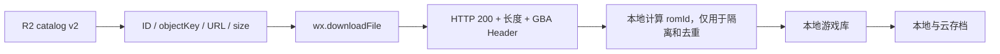

# Cloudflare R2 ROM 广场开发与发布文档

版本：2.0

状态：真实 R2 已核对；本地目录已生成，远端目录尚未上传

更新日期：2026-08-02

## 1. 本次确认结论

2026-08-02 通过用户已登录的 Chrome 会话读取 Cloudflare Dashboard，并通过控制台自身的对象接口取得 `gba/` 完整列表。检查过程只读取对象元数据；对公开对象仅发送 `HEAD` 请求，没有下载 ROM 正文，也没有修改 R2 配置。

| 项目 | 实际值 |
| --- | --- |
| Account ID | `aa1f1424bb0e9156ec75328626ea326b` |
| Bucket | `rom` |
| 创建时间 | 2025-07-25 |
| 区域 | APAC |
| Bucket 总大小 | Dashboard 显示 `9.74 GB` |
| S3 API | `https://aa1f1424bb0e9156ec75328626ea326b.r2.cloudflarestorage.com/rom` |
| 生产自定义域名 | `https://rom.sid.mom`，状态正常、公开访问已启用 |
| R2.dev | `https://pub-af0f767c88c94b9cae263062533d7603.r2.dev`，仅适合开发检查 |
| CORS | 未配置 |
| R2 Data Catalog | 未启用 |
| 默认存储类 | Standard |
| Local upload | 未启用 |

自定义域名根路径返回 `404 Object not found`，这是因为根对象不存在，不代表域名不可用。对一个现有 `gba/` 对象执行 `HEAD` 返回 `200`、正确 `Content-Length`、`ETag` 和 `Last-Modified`，证明对象可匿名读取。响应中没有 `Access-Control-Allow-Origin`。

## 2. GBA 对象清单

完整清单位于 `minigba-app/catalog.r2.json`，它是当前 981 个对象的逐项事实记录，可直接查看每个文件的：

- 目录 ID；
- 完整 R2 object key；
- 原始文件名/展示标题；
- 公开下载 URL；
- 精确字节数；
- R2 ETag；
- 最后修改时间；
- 从 No-Intro 风格文件名提取出的地区和语言信息。

汇总：

| 指标 | 结果 |
| --- | --- |
| 对象数 | 981 |
| 总字节数 | `7,725,253,970` B（约 `7.195 GiB`） |
| 扩展名 | 981 个均为 `.gba` |
| 对象 key 重复 | 0 |
| ETag 重复 | 0 |
| 最早修改时间 | `2025-07-27T09:28:50.884Z` |
| 最晚修改时间 | `2025-07-29T04:26:06.467Z` |
| HTTP metadata | 981 个均为空 |
| Custom metadata | 981 个均为空 |
| 标记统计 | Beta 18、Prototype 6、Revision 13、Alt 2、多语言 205 |

主要大小分布：

| 字节数 | 对象数 |
| ---: | ---: |
| 4,194,304 | 418 |
| 8,388,608 | 421 |
| 16,777,216 | 113 |
| 33,554,432 | 15 |
| 其他大小 | 14 |

14 个非主要容量对象必须保留精确 `sizeBytes`，不能向上取整：

| Object key | 字节数 |
| --- | ---: |
| `gba/Bratz (USA) (En,Fr,Es).gba` | 3,538,944 |
| `gba/Bratz - Babyz (USA).gba` | 3,407,872 |
| `gba/Bratz - Forever Diamondz (USA).gba` | 1,179,648 |
| `gba/CodeBreaker (USA) (Unl).gba` | 65,536 |
| `gba/GBA Personal Organizer (USA) (Unl).gba` | 1,048,576 |
| `gba/GP-1 Racing (USA) (Proto).gba` | 2,097,152 |
| `gba/GameShark GBA (USA) (Alt 1) (Unl).gba` | 262,144 |
| `gba/GameShark GBA (USA) (Unl).gba` | 262,144 |
| `gba/Rocket Power - Beach Bandits (USA) (v0.14) (Beta).gba` | 4,101,616 |
| `gba/SpongeBob SquarePants - Revenge of the Flying Dutchman (USA) (Beta).gba` | 8,166,400 |
| `gba/SpongeBob SquarePants Movie, The (USA) (Beta).gba` | 6,871,418 |
| `gba/Starsky & Hutch (USA) (Beta).gba` | 4,231,928 |
| `gba/Tyrian 2000 (USA) (Proto).gba` | 2,681,544 |
| `gba/Wild Thornberrys Movie, The (USA) (Beta).gba` | 3,374,120 |

对象名不能证明 ROM 正文有效或拥有公开分发权。当前 R2 没有 MIME、封面、游戏代码、分类或权利元数据；这些字段需要运营方后续补录。

## 3. 不做 SHA-256 前置校验的边界

按当前要求，R2 目录 schema v2 不包含 ROM SHA-256，客户端不会要求用户输入 SHA-256，也不会把下载正文与预置 SHA-256 比对。

仍保留以下检查：

1. 目录和下载 URL 必须为无凭证、无 fragment 的 HTTPS。
2. URL 的精确 `host[:port]` 必须命中编译期白名单。
3. 目录 ID 与 object key 必须唯一；object key 必须位于 `gba/` 且以 `.gba` 结尾。
4. `sizeBytes` 必须是 192 B 到 32 MiB 的整数。
5. 下载必须返回 HTTP 200；响应长度和落盘文件长度必须与 `sizeBytes` 一致。
6. 落盘后检查 GBA 固定头；Nintendo Logo/header checksum 异常时要求用户再次确认。
7. 全部检查完成后才原子写入本地游戏库。

下载成功后仍会在本机计算内容 SHA-256 作为内部 `romId`，用于去重、分片存储和存档/云存档隔离。该值不是 R2 下载准入条件，也不与 catalog 或 ETag 比较。存档正文、WASM 产物和发行包的 SHA-256 校验不受本次变更影响。



## 4. 对象布局

当前实际布局是原始文件名目录：

```text
gba/<original-file-name>.gba
```

新增客户端目录对象使用独立版本路径：

```text
catalog/v2/roms.json
catalog/v2/archive/roms-<UTC timestamp>.json
```

小程序不持有 R2/S3 凭证，也不能调用 Cloudflare Dashboard API。`catalog/v2/roms.json` 是小程序唯一的列表入口；直接暴露 `ListObjects` 会泄漏管理凭证，不允许使用。

## 5. Catalog schema v2

示例：

```json
{
  "schemaVersion": 2,
  "generatedAt": "2026-08-02T03:14:35.162Z",
  "bucket": "rom",
  "items": [
    {
      "id": "b63b2244edc2385ae1eab9c8ee448c6f",
      "title": "Example Game (USA)",
      "objectKey": "gba/Example Game (USA).gba",
      "etag": "b63b2244edc2385ae1eab9c8ee448c6f",
      "downloadUrl": "https://rom.sid.mom/gba/Example%20Game%20(USA).gba",
      "sizeBytes": 8388608,
      "genres": [],
      "region": "USA",
      "language": "En, Fr, De",
      "featured": false,
      "updatedAt": "2025-07-27T09:28:50.884Z"
    }
  ]
}
```

字段规则：

| 字段 | 规则 |
| --- | --- |
| `schemaVersion` | 必须为整数 `2` |
| `generatedAt` | 有效 ISO 8601 时间 |
| `bucket` | 必须为 `rom` |
| `items` | 最多 2,000 项；当前为 981 项 |
| `id` | 1–128 个安全 ASCII 字符，目录内唯一；当前使用 R2 ETag 作为版本 ID，但不用于正文校验 |
| `title` | 1–128 字符 |
| `objectKey` | 1–400 字符，必须是 `gba/*.gba`，目录内唯一 |
| `downloadUrl` | HTTPS 绝对/相对 URL，解析后 host 必须在白名单 |
| `sizeBytes` | 192 B–32 MiB 的精确整数 |
| `etag` | 可选，只展示对象版本，不作为安全摘要 |
| `license` | 可选；存在时校验名称和 HTTPS URL，不存在时 UI 显示“权利信息未标注” |

`gameCode`、`description`、`genres`、`region`、`language`、`coverUrl`、`featured` 和 `updatedAt` 均为展示元数据。客户端不得根据缺失的展示字段阻止一个满足技术校验的条目下载。

## 6. 目录生成

生成器位于 `minigba-app/scripts/generate-r2-rom-catalog.mjs`，输入为 Cloudflare 对象接口的 `result` 数组、`objects` 数组或直接对象数组。生成器不读取 ROM 正文，也不计算 SHA-256。

只允许在 Ubuntu 22.04 裸机运行：

```bash
cd minigba-app
export TARO_APP_ROM_PUBLIC_BASE_URL=https://rom.sid.mom
npm run generate:catalog -- /secure/r2-objects.json catalog.r2.json
TARO_APP_ROM_DOWNLOAD_HOSTS=rom.sid.mom \
  npm run validate:catalog -- catalog.r2.json
```

`r2-objects.json` 必须来自受控的 R2 管理导出，至少包含 `key`、`etag`、`size`、`last_modified`。不得把 Cloudflare cookie、API token 或 S3 secret 写进输入文件、Git 或构建日志。

## 7. 生产配置

App 编译环境：

```bash
export TARO_APP_API_BASE_URL=https://api.example.com
export TARO_APP_ROM_CATALOG_URL=https://rom.sid.mom/catalog/v2/roms.json
export TARO_APP_ROM_CATALOG_REMOTE_ENABLED=false
export TARO_APP_ROM_DOWNLOAD_HOSTS=rom.sid.mom
```

`false` 是当前正确值：构建会把 `catalog.r2.json` 编入小程序，启动和手动刷新均不会请求尚未发布的远端目录。完成第 8 节上传并通过公开校验后，才可改为 `true` 构建新版本。

微信公众平台必须加入：

- `request` 合法域名：`https://rom.sid.mom`；
- `downloadFile` 合法域名：`https://rom.sid.mom`；
- 云存档 API 域名另行配置。

微信小程序原生 `request/downloadFile` 不以浏览器 CORS 作为合法域名替代品。若同一目录还要供 H5 或管理页面读取，再在 R2 配置仅允许 `GET`、`HEAD` 的 CORS；当前 Dashboard 中 CORS 为空。

## 8. 上传与回滚

本次没有替用户上传对象或修改 Cloudflare 权限。确认上传后，在 Ubuntu 22.04 裸机使用最小权限 R2 凭证：

```bash
export AWS_ACCESS_KEY_ID='R2 scoped key id'
export AWS_SECRET_ACCESS_KEY='R2 scoped secret'
export R2_ENDPOINT='https://aa1f1424bb0e9156ec75328626ea326b.r2.cloudflarestorage.com'

aws s3 cp catalog.r2.json \
  s3://rom/catalog/v2/archive/roms-20260802T031435Z.json \
  --endpoint-url "$R2_ENDPOINT" \
  --content-type 'application/json; charset=utf-8' \
  --cache-control 'public, max-age=300, must-revalidate'

aws s3 cp catalog.r2.json \
  s3://rom/catalog/v2/roms.json \
  --endpoint-url "$R2_ENDPOINT" \
  --content-type 'application/json; charset=utf-8' \
  --cache-control 'public, max-age=300, must-revalidate'
```

上传后必须验证：

```bash
curl --fail --head https://rom.sid.mom/catalog/v2/roms.json
TARO_APP_ROM_DOWNLOAD_HOSTS=rom.sid.mom \
  npm run validate:catalog -- https://rom.sid.mom/catalog/v2/roms.json
```

验证通过后设置 `TARO_APP_ROM_CATALOG_REMOTE_ENABLED=true` 并重新构建；远端启用前的已发布包继续使用内置目录，不受远端 404 影响。

回滚时先确认旧目录引用的对象仍存在，再把对应 archive 文件覆盖到 current 路径。目录缓存只有在新目录完整通过校验时才替换；失败时客户端保留上一份有效缓存并标记为缓存目录。

## 9. 客户端行为

- 首页默认显示 ROM 广场，并可切换“我的游戏”和“游玩记录”。
- 当前包以 981 项内置目录启动；远端开关关闭时刷新不发送网络请求，不会产生 `catalog/v2/roms.json` 404。
- 981 个条目支持标题、object key、地区、语言、游戏代码和分类搜索；首页每批渲染 60 条，长标题在列表中省略，详情页完整显示。
- 广场使用 catalog `id` 判断安装关系；下载完成后把 catalog `id` 与本地 `romId` 关联。
- 详情页展示 R2 object key、字节大小、地区/语言、ETag、权利标记、本地内容 ID、存档和游玩记录。
- 已安装条目进入详情，不重复下载；相同正文即使来自不同 URL，也由本地内容 ID 去重。
- 删除 ROM 默认保留存档和游玩记录；删除 ROM 与存档需要明确二次确认。

## 10. 验收清单

- [x] 真实 bucket、自定义域名、公开访问、CORS 和对象前缀已检查。
- [x] `gba/` 981 个对象已生成 schema v2 本地目录。
- [x] 本地目录通过 2,000 项上限、ID/key 唯一性、URL、host 和精确长度校验。
- [x] 客户端不要求或比对预置 ROM SHA-256。
- [ ] `catalog/v2/roms.json` 已获授权上传到 R2，并通过公开读取验证。
- [ ] `rom.sid.mom` 已加入微信 `request` 和 `downloadFile` 合法域名。
- [ ] iOS/Android 真机完成 981 项目录加载、搜索、缓存、下载、安装和启动测试。
- [ ] 14 个非主要容量对象完成 GBA Header 与核心启动抽样。
- [ ] 对外发行前完成对象权利信息审查和必要的下架流程。
- [ ] R2 凭证未进入小程序、Git、catalog、日志或诊断包。
- [ ] 整个构建、上传和验证过程只在 Ubuntu 22.04 裸机执行，未使用 Docker、WSL 或虚拟机。
